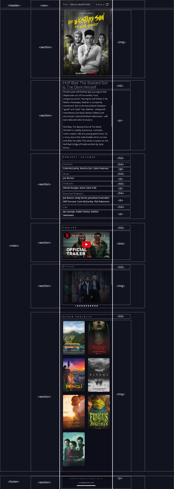

# Procesverslag
Markdown is een simpele manier om HTML te schrijven.  
Markdown cheat cheet: [Hulp bij het schrijven van Markdown](https://github.com/adam-p/markdown-here/wiki/Markdown-Cheatsheet).

Nb. De standaardstructuur en de spartaanse opmaak van de README.md zijn helemaal prima. Het gaat om de inhoud van je procesverslag. Besteedt de tijd voor pracht en praal aan je website.

Nb. Door *open* toe te voegen aan een *details* element kun je deze standaard open zetten. Fijn om dat steeds voor de relevante stuk(ken) te doen.

## Jij

  
uitwerken voor kick-off werkgroep

  ### Auteur:
  Marelva Tjon A Koy

  #### Je startniveau:
  Blauw 

  #### Je focus:
 surface laag
 

## Je website

  
uitwerken voor kick-off werkgroep

  ### Je opdracht:
 https://www.imaginariumuk.com 

  #### Screenshot(s) van de eerste pagina (small screen): 
  Home pagina imaginarium
  

  #### Screenshot(s) van de tweede pagina (small screen):
  Detailpagina imaginarium
  
 

## Toegankelijkheidstest 1/2 (week 1)

  
uitwerken na test in 2e werkgroep

  ### Bevindingen
  Lijst met je bevindingen die in de test naar voren kwamen: Dat het een goed gecodeerde site is.  Er werd code gebruikt die ik niet in de eerste instantie begreep. Ik had als eerste gedachte dat dit een te moeielijke site was voor mij om te coderen sinds dat ik vind dat ik er niet goed in ben. Ik ben toch maar voor de uitdaging gegaan om uit mijn comfort zone te gaan en zo beter in dit vak wordt.

## Breakdownschets (week 1)

  
uitwerken na afloop 3e werkgroep

  ### de hele pagina: 
  

  ### de hele pagina 2: 
  

## Voortgang 1 (week 2)

  
uitwerken voor 1e voortgang

  ### Stand van zaken
 Ik was hier bezig met de eerste opzet van mijn pagina. Ik wist eerst niet goed hoe ik het plaatje goed als achtergond moest instellen zonder dat het de hele pagina overneemt en ging ik ook onderzoek doen hoe ik er een fade over het plaatje heen kan doen. In het begin kwam ik er niet goed uit en heb ik hulp gevraagd bij de studentassisten. Hun hadden me goed op weg gezet met de opzet en kon ik zo makkelijk verder. 
  

  ### Agenda voor meeting
  samen met je groepje opstellen

  Chante : Hoe ze goed de layout kan maken met grid
  Marelva: Hoe ik de achtergond kan instellen voor een bepaalde stuk
  Maeike: Hoe svg bestanden werken
  Jens: Hoe hij een video als achtergond kan doen

  ### Verslag van meeting
  hier na afloop snel de uitkomsten van de meeting vastleggen

  - Dat je fr moet gebruiken voor het grootte van een vak
  - Dat het beste is om een selectie een achtergond te geven

## Voortgang 2 (week 3)

  
uitwerken voor 2e voortgang

  ### Stand van zaken
 Ik had dit keer moeite met het animeren van mijn plaatjes. Het ziet er heel gek uit en gaat niet smooth door dus ik wilde draag graag hulp bij.

  ### Agenda voor meeting
  samen met je groepje opstellen

Chante: Hoe kan ik de tekst in de menu centeren
Marelva: Hoe krijg ik mijn animaties smooth
Maeike: Hoe kan ik ervoor zorgen dat mijn menu goed responsive meewerkt
Jens: Hoe kan ik een boarder creeeren op een bepaald stuk

  ### Verslag van meeting
 
- ...

- Als je iets wilt centeren meot je evoor zorgen dat je de juiste ding aanspreekt
- maak gebruik van animation-fill-mode: forwards; bij de animatie
- schijf bij elk stuk groote de css van de menu

## Toegankelijkheidstest 2/2 (week 4)

  
uitwerken na test in 9e werkgroep

  ### Bevindingen
  Lijst met je bevindingen die in de test naar voren kwamen (geef ook aan wat er verbeterd is):

  - In de eerste keer dat ik de test heb gedaan kwam ik erachter dat de knoppen niet duidelijk werd aangegeven dus daarmee heb ik mee verder gewerkt.
  - Dat ik nog states toevoegen.
  - Dat ik erop let dat alle html geen erros heeft

## Voortgang 3 (week 4)

  
uitwerken voor 3e voortgang

  ### Stand van zaken
  Ik vind wel dat ik nu lekker op gang gaat. Ik heb  al bijna mijn eerste pagina af. Het is alleen nog een kwestie van verder coderen. Op dit moment zijn er geen dingen waar ik tegen aan loop en voel ik me wel zelfverzekerd in dit proces. Ik was in het begin wel bang dat ik het niet zou kunnen maar kom al aardig op gang.

  ### Agenda voor meeting
  samen met je groepje opstellen

Chante: hoe kan ik tekst samen met een plaatje positioneren
Marelva: Geen vragen
Maike: Hoe krijg ik die tekst ergens anders te staan
Jens: hoe voeg je een extrene css stijl toe

  ### Verslag van meeting
  hier na afloop snel de uitkomsten van de meeting vastleggen

- voor een extrene stijl moet je gebruik maken van links en je site aan die stijl verbinden. 
- gebruik maken van display flex 

## Eindgesprek (week 5)

  
uitwerken voor eindgesprek

  ### Je uitkomst - karakteristiek screenshots:
  
   

  ### Dit ging goed/Heb ik geleerd: 
Ik heb best wel veel over coderen geleed in dit vak. Eerst zing ik er niet met veel zelfvertrouwen erin. Ik heb wel op veel factoren gegoeid. Ik weet nu hoe i met grid moet werken en hoe ik bepaalde secties een achtergond plaatje moet geven. Eerst wist ik niet hoe ik moest animeren en heb ik wel een geveol dat ik daar beter in bent. Ook ben ik beter geworden met positioneren sinds dat ik daar vorig jaar erg tegen op liep.

  
  

  ### Dit was lastig/Is niet gelukt:
Het is me niet gelukt om als achtergond een soort images slide show te doen. Het was wel graag iets wat ik wilde proberen maar niet op een manier kwam hoe ik het dan zou snappen hoe het werkt. Dus heb ik ervoor gekozen om 1 plaatje als achtergond te doen.  

  

## Bronnenlijst

  
continu bijhouden terwijl je werkt

  Nb. Wees specifiek ('css-tricks' als bron is bijv. niet specifiek genoeg). 
  Nb. ChatGpT en andere AI horen er ook bij.
  Nb. Vermeld de bronnen ook in je code.

    youtube video: https://www.youtube.com/watch?v=OVBjPpUlQrE
    images/ content:  https://www.imaginariumuk.com/
    Links: https://www.netflix.com/title/80993105
    info: https://chat.openai.com
    https://www.w3schools.com

