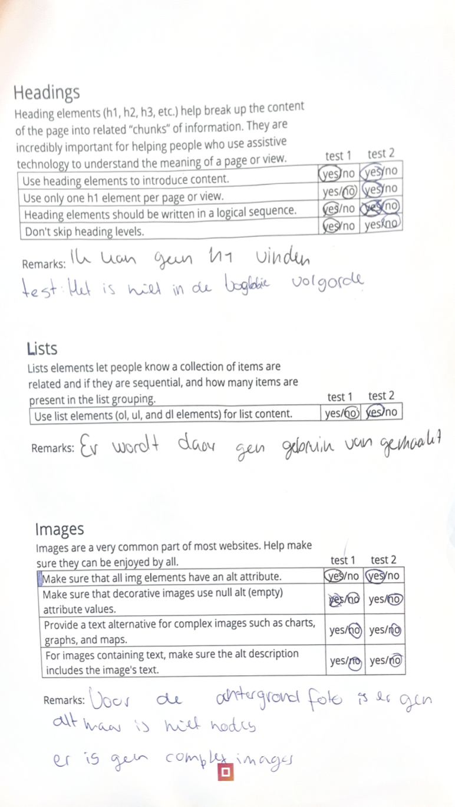

# Procesverslag
Markdown is een simpele manier om HTML te schrijven.  
Markdown cheat cheet: [Hulp bij het schrijven van Markdown](https://github.com/adam-p/markdown-here/wiki/Markdown-Cheatsheet).

Nb. De standaardstructuur en de spartaanse opmaak van de README.md zijn helemaal prima. Het gaat om de inhoud van je procesverslag. Besteedt de tijd voor pracht en praal aan je website.

Nb. Door *open* toe te voegen aan een *details* element kun je deze standaard open zetten. Fijn om dat steeds voor de relevante stuk(ken) te doen.

## Jij

  
uitwerken voor kick-off werkgroep

  ### Auteur:
  Marelva Tjon A Koy

  #### Je startniveau:
  Blauw 

  #### Je focus:
  Surface laag
 

## Je website

  
uitwerken voor kick-off werkgroep

  ### Je opdracht:
 https://www.imaginariumuk.com 

  #### Screenshot(s) van de eerste pagina (small screen): 
  Home pagina imaginarium
  

  #### Screenshot(s) van de tweede pagina (small screen):
  Detailpagina imaginarium
  
 

|

## Toegankelijkheidstest 1/2 (week 1)

  
uitwerken na test in 2e werkgroep

  ### Bevindingen
  Dit was de eerste keer dat ik met WCAG checklist ging werken. Bij sommige vragen moest ik nog opzoeken wat de vraag inhoudt. Tijdens het checken van de lijst kwam ik uit de volgende bevindingen:

  - Het een goed gecodeerde site is er zat er maar 1 fout in wat niet fataal is. 

  - Er werd niet duidelijk aangegeven als iets klikbaar of een knop is. Het leek op normale tekst. 

  - De knoppen staat ook erg dichtbij andere elementen wat hegt moeilijker maakt op precies op te drukken. 

  - Er wordt geen gebruik gemaakt van ol,ul en dl elementen.

  - Bij de uiterlijk van de site wordt er vaak alleen van kleur gebruikt voor informatie zoals bij een knop.

  - Wanneer je door de site heen tapt gaat het niet langs alle elementen. 

  - Ik kon geen h1 vinden en er werd veel code gebruikt die ik nog niet begreep.

  - Op achtergond plaatjes is er geen alt tekst maar dat is niet ook niet nodig voor een achtergrond tekst. 

  - De site biedt geen dark of light mode optie de site is van zichzelf al donker en heeft geen optie om het lichter te maken. 

  - De achtergond plaatjes veranderen elke keer en er is geen optie om dat uit te doen. 

  Uit deze bevindingen wil ik vooral in mijn site gaan letten dat ik duidelijke knoppen gebruikt. Dus ik ga niet zoals in de site alleen met kleur gebruiken.  Ik ga ook geen achtergond maken die de hele tijd beweegt en geen optie is om dat uit te zetten. Ook wil ik een goede light en darkmode optie zodat het meer inclusiever is voor mensen die sneller geprikkeld wordt. 

  
  
  
  
  

## Breakdownschets (week 1)

  
uitwerken na afloop 3e werkgroep

  ### de hele pagina: 
  

  ### de hele pagina 2: 
  

## Voortgang 1 (week 2)

  
uitwerken voor 1e voortgang

  ### Stand van zaken

Hier had ik eerst moeite mee om een gradient over een achtergondplaatje te zetten. En wist ik eerst niet hoe ik dat moest doen met een ander plaatje overheen. 

Hier is het me gelukt om voorverschillende secties een andere achtergond foto te zetten. Ik had eerst wel moeite uitvolgelen hoe ik het goed kon positioneren maar met behulp van de studentassitent is het gelukt. 

  ### Agenda voor meeting
  samen met je groepje opstellen

  Chante : Hoe ze goed de layout kan maken met grid en waarom die van haar niet werkt zoals ze wilt.

  Marelva: Hoe ik de achtergond kan instellen voor een bepaalde sectie en hoe ik het plaatje dan goed kan posionteren.

  Meike: Hoe svg images werken en hoe ze het in haar website kan laten werken. 

  Jens: Hoe hij een video als achtergond kan doen hoe hij het er beste eruit kan laten zien.

  ### Verslag van meeting
  hier na afloop snel de uitkomsten van de meeting vastleggen

  - Dat er op een section een achtergond foto moet zetten zodat het alleen daarvoor geldt.
 
 - Dat is ascpect radio moest gebruiken om het plaatje de juiste groote te geven.

 - De opdrachten proberen te maken zodat ik het beter kan begrijpen en die code in mijn site kan gebruiken. 

## Voortgang 2 (week 3)

  
uitwerken voor 2e voortgang

  ### Stand van zaken

Ik had hier moeite met het positoneren van een foto. Het lukte me eerst niet op het in het midden te krijgen. Ik kwam er later achter na het vragen van medestudenten om mee te kijken dat ik het verkeerd aansprak in css. 

Het was me goed gelukt om een mooie grid te maken. Na het maken van de opdrachten begreep ik al snel hoe grid werkte en heb ik het verwerkt in mijn site. Daarnaast was het me ook gelukt om een hoveranimatie te zetten over de images. 

  ### Agenda voor meeting
  samen met je groepje opstellen

Chante: Hoe kan ze een spatie weg krijgen bij de footer aan het eind van de pagina?

Marelva: Hoe krijg ik dat mijn animaties smooth animeren en hoe laat ik ze goed werken?

Maeike: Hoe kan ik ervoor zorgen dat mijn menu goed responsive meewerkt?

Jens: Hoe kan ik mijn hamburger menu laten werken.

  ### Verslag van meeting
 

- Ik moet beter mijn readme bijhouden zodat het later geen verveldende taak meer is.

- Maak gebruik van animation-fill-mode: forwards; bij de animatie.

- Zorg dat je de goede animatie naam aanspreekt. 

- Dat ik door mijn pagina heen kan tabben.

## Toegankelijkheidstest 2/2 (week 4)

  
uitwerken na test in 9e werkgroep

  ### Bevindingen
  
  
  
  
  

  Lijst met je bevindingen die in de test naar voren kwamen (geef ook aan wat er verbeterd is):

  - Ik kwam er achter dat mijn knoppen nog niet duidelijk werd aangegeven en dat heb ik toen verbeterd.

  - Ik had geen darkmode optie dus die moest ik nog toevoegen.

  - Dat ik nog states toevoegen.

  - Dat ik erop let dat alle html geen erros heeft en ik heb daarna alle errors verbetererd. 

  Na mijn eindgesprek ben ik opnieuw met de lijst langs mijn site gegaan er kwam eruit dat ik nog paar dingen kon verbeteren om mijn site optimaler te maken:

  - Mijn darkmode optie was niet sterk genoeg en kon beter die site laten als een dark mode en dat ik een light mode versie maakt zodat er wel genoeg verschil is in te zien. 

  - Ik ben ook gaan kijken naar hoe het werkt het de screenreader en het las alles goed voor wat op het scherm is te zien. 

  - Er staan ook allemaal alt teksten op mijn plaatjes en mijn code heeft geen errors.

  - Ook staat alle h1 en andere h goed op volgorde. 

  - Je kan door mijn site heen tabben. 

  - Er wordt geen alt tekst gebruikt op de achtergond foto's

## Voortgang 3 (week 4)

  
uitwerken voor 3e voortgang

  ### Stand van zaken
  Ik vind wel dat ik nu lekker op gang gaat. Ik heb  al bijna mijn eerste pagina af. Het is alleen nog een kwestie van verder coderen. Op dit moment zijn er geen dingen waar ik tegen aan loop en voel ik me wel zelfverzekerd in dit proces. Ik was in het begin wel bang dat ik het niet zou kunnen maar kom al aardig op gang.

  ### Agenda voor meeting
  samen met je groepje opstellen

Chante: hoe kan ik tekst samen met een plaatje positioneren
Marelva: Geen vragen
Maike: Hoe krijg ik die tekst ergens anders te staan
Jens: hoe voeg je een extrene css stijl toe

  ### Verslag van meeting
  hier na afloop snel de uitkomsten van de meeting vastleggen

- voor een extrene stijl moet je gebruik maken van links en je site aan die stijl verbinden. 
- gebruik maken van display flex 

## Eindgesprek (week 5)

  
uitwerken voor eindgesprek

  ### Je uitkomst - karakteristiek screenshots:
  
   

  ### Dit ging goed/Heb ik geleerd: 
Ik heb best wel veel over coderen geleed in dit vak. Eerst zing ik er niet met veel zelfvertrouwen erin. Ik heb wel op veel factoren gegoeid. Ik weet nu hoe i met grid moet werken en hoe ik bepaalde secties een achtergond plaatje moet geven. Eerst wist ik niet hoe ik moest animeren en heb ik wel een geveol dat ik daar beter in bent. Ook ben ik beter geworden met positioneren sinds dat ik daar vorig jaar erg tegen op liep.

  
  

  ### Dit was lastig/Is niet gelukt:
Het is me niet gelukt om als achtergond een soort images slide show te doen. Het was wel graag iets wat ik wilde proberen maar niet op een manier kwam hoe ik het dan zou snappen hoe het werkt. Dus heb ik ervoor gekozen om 1 plaatje als achtergond te doen.  

  

## Bronnenlijst

  
continu bijhouden terwijl je werkt

  Nb. Wees specifiek ('css-tricks' als bron is bijv. niet specifiek genoeg). 
  Nb. ChatGpT en andere AI horen er ook bij.
  Nb. Vermeld de bronnen ook in je code.

    youtube video: https://www.youtube.com/watch?v=OVBjPpUlQrE
    images/ content:  https://www.imaginariumuk.com/
    Links: https://www.netflix.com/title/80993105
    info: https://chat.openai.com
    https://www.w3schools.com

